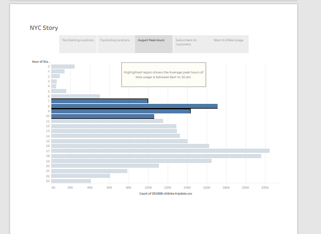
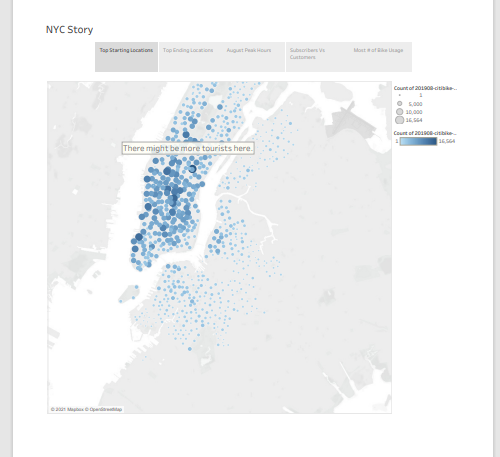
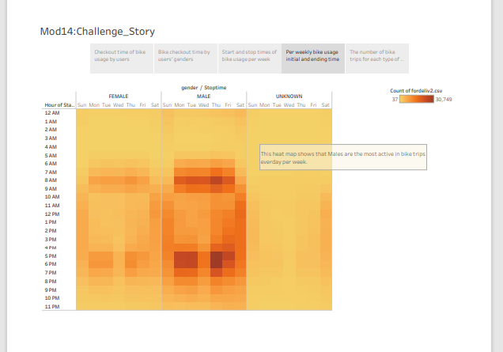
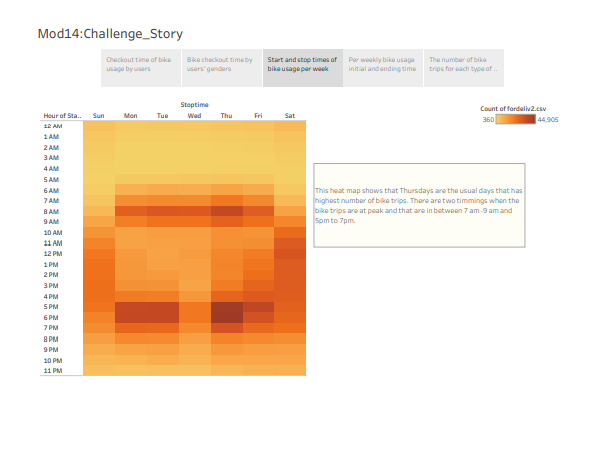
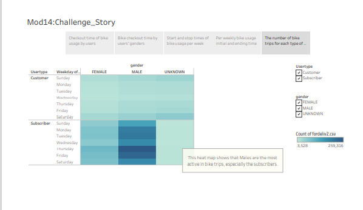
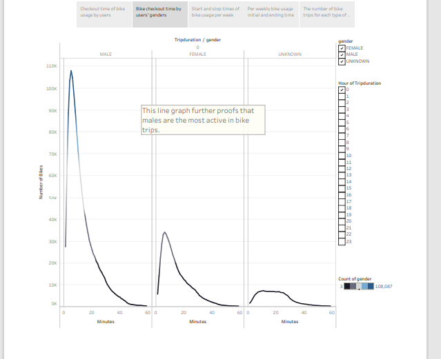
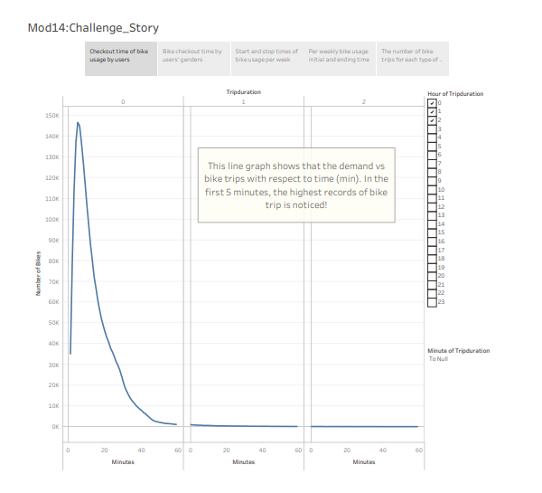

# bikesharing_Module14

## **Brief Summary:** 

In this Module, I have benefited to gain and apply the knwoledge of analysing Bike-sharing data by using Tableau. In summary, Tableau is an advance version of Microsoft Excel and its Pivot tables. The only difference is that it can handle a very big data in few seconds ; excel, however, has limited number of rows and columuns and it can be sluggish when faced by a large amount of data. 

The Project is based on analyses of Bike-sharing data on Des Moines. This is done to prove to investors that this business decision will be a prudential one by keeping NYC bike-sharing data as a base. 

## **Results**
- ***NYC tableau results:***

-- 1. This bar graphs shows the peak times of bike sharings and it is between 6a m to 10 am. 

--2. This symbol Map shows the map of NYC that has highest activities related to bike sharing/trips. It is basically because of the tourists present there. The start and ending locations for the bike sharing/trips is almost same. 

- ***Des Moines results:***

--3.  The Heat Map shows that Males are the most active in bike trips, per week. 

--4. This heat map shows that Thursdays are the days that the bike-sharing business is at its peak. The usual time is in the mornings [7am - 9am] and evenings [5pm to 7pm]. 

--5. This heat map further backs the previous figures. It shows that the male subscribers are the most active in the business.

--6. This line graph that depicts number of trips vs minutes depicts that Males are the most active customers/subscribers that are involved in the highest number of bike trips. 

--7. The number of trips vs minutes line-graph notices that there is the highest demand of customers in the first 5 minutes! 

--

## ***Summary:***

After analysing the data, it is categorically seen that the males are the most active in the bike trips. 

According to the "World Population Review",
the population is further expected to increase in Desmoines. Thus, Male population is surely tend to increase too. Therefore, the bike-sharing business in Des Moines is a wise one!

Reference: https://worldpopulationreview.com/us-cities/des-moines-ia-population

Please Note: To access the Tableau files, please visit: https://public.tableau.com/app/profile/zohair.k
